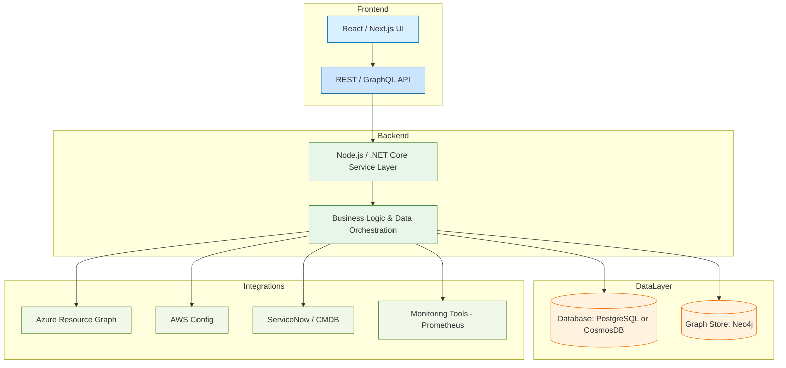

# AppMatrix

AppMatrix is a centralized platform designed to help teams build and maintain a comprehensive **Application and Infrastructure Inventory**.  
It provides a unified view of applications, their associated infrastructure components, ownership, and dependencies across environments.

---

## 🚀 Overview

AppMatrix simplifies infrastructure visibility by aggregating data from various systems and representing it in an intuitive, connected graph.  
It enables organizations to manage key application metadata such as:

- Application details and ownership  
- Network and infrastructure configurations  
- Load balancer, firewall, and domain mappings  
- Cross-application and infrastructure dependencies  
- Relationship visualization through dependency graphs  

---

## 🧩 Key Features

- **Application Registry** – Centralized catalog for all applications and microservices.  
- **Infra Inventory** – Detailed records of load balancers, firewalls, VMs, network segments, and domains.  
- **Dependency Graph** – Visual representation of how applications and infra components interconnect.  
- **Ownership Tracking** – Identify responsible teams or owners for each component.  
- **Search & Filter** – Easily locate assets or dependencies using powerful filters.  
- **Extensible APIs** – Integrate with CMDBs, monitoring tools, or CI/CD pipelines for automated data sync.

---

## 🏗️ Architecture

The high-level architecture of **AppMatrix** follows a modular and extensible pattern, ensuring scalability and easy integration.

---

## 💡 Use Cases

- Maintain an up-to-date inventory of all applications and infrastructure assets.  
- Understand dependency impact before deployments or infra changes.  
- Improve collaboration between application, infra, and network teams.  
- Enhance operational visibility and reduce downtime risks.

---

## 🧠 Future Enhancements

- Real-time sync with cloud APIs (Azure Resource Graph, AWS Config, etc.)  
- Role-based access and audit tracking  
- Automated discovery and mapping  
- Visualization dashboard with React Flow or D3.ks / GraphQL support  

---

## 📜 License

This project is released under the [MIT License](LICENSE).

---

## 👥 Contributors

Maintained by the **AppMatrix Team** — passionate about simplifying infrastructure intelligence.
